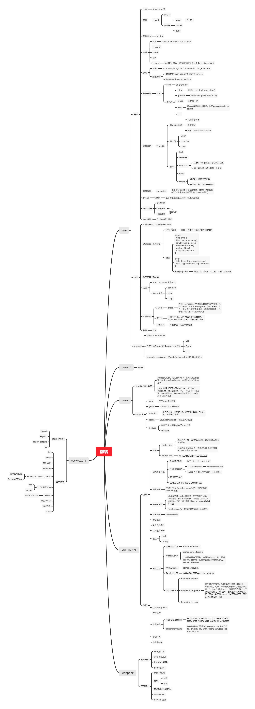

# vue-study
Vue 学习笔记

## 思维导图

* 

## 阅读顺序：

* [vue知识回顾](vue知识回顾.md)
* [vue组件知识](vue组件知识.md)
* [vue-router知识回顾](vue-router知识回顾.md)
* [vuex知识回顾](vuex知识回顾.md)

## 其他

* [ES6语法](ES6语法.md)
* [异步操作](异步操作.md)
* [webpack入门](webpack入门.md)
